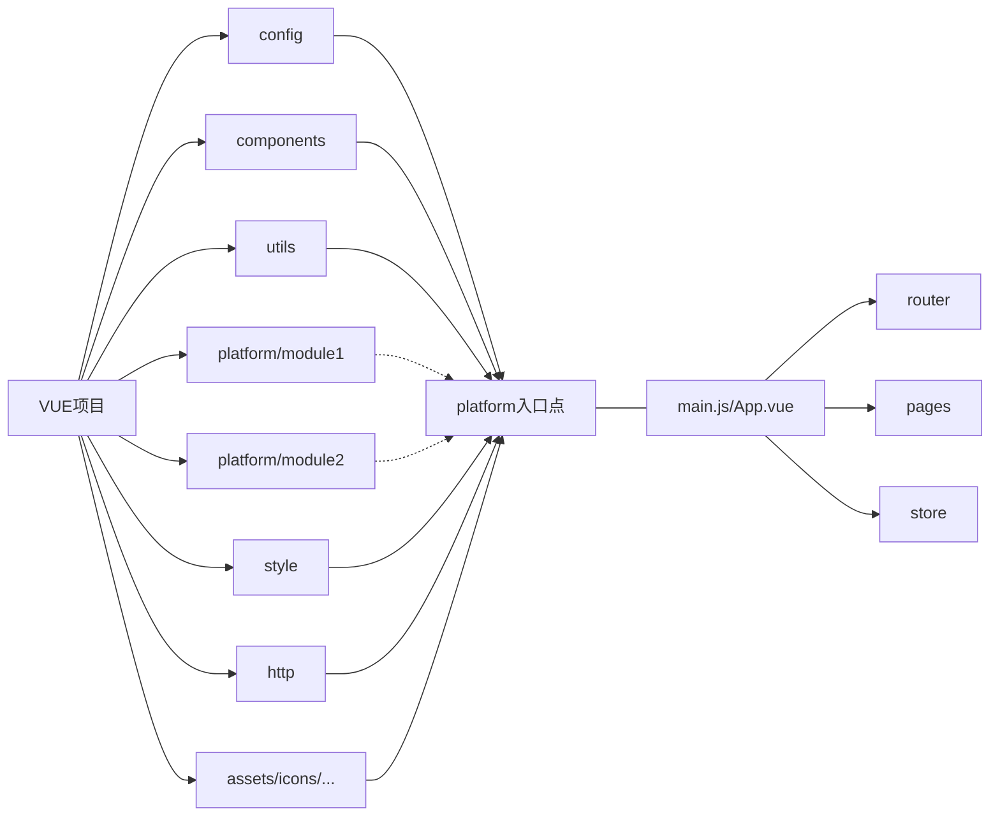

# best-do-vue
vue多页面开发最佳实践，是由单页面最佳实践改造而来。

如果要使用单页面开发模式，将platform下的子目录展开即可，在脚手架配置vue.config.js中注释掉pages相关代码。

最佳实践的代码结构如下：

`Mark:`

1. `config`敏感\关键信息配置、存储在前端的业务配置/字典包，不经过编译压缩等处理
2. `components`全局无状态组件，基于同一系统中不同业务平台控件应表现一致的假设
3. `utils`全局数据处理方法，纯函数式编程，字段校验/数据格式化/数据标准化等
4. `platform/module1`、`platform/module2`系统中不同平台模块
5. `style`全局样式文件，遵循样式分类管理办法，基于同一系统中不同业务平台风格表现一致的假设
6. `http`全局请求封装，包含api集中管理、接口规范封装等。基于同一系统中使用一套稳定的接口规范的假设
7. `assets/icons/...`其他静态资源管理，包含图片、音视频、svg图标等常见静态资源
8. `main.js/App.vue`平台业务模块入口逻辑，集约所有的公共资源
9. `router`平台业务模块自身的路由逻辑实现，不同平台间完全隔离
10. `pages`平台业务模块页面逻辑的实现
11. `store`平台业务数据共享存储