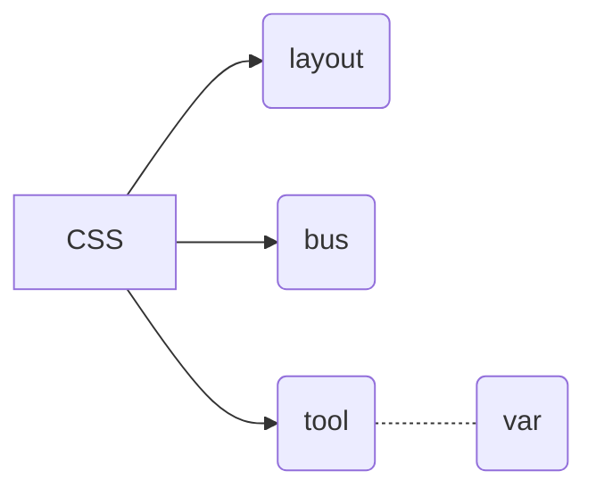

# best-do-css
css管理最佳实践

> css管理最大的痛点是随意，由于样式可以进行反复覆盖，并且某些属性具有天然的继承性，导致样式管理没有比较清晰的脉络，常常发生一些诡异的布局问题。

经实践css管理目前最佳的实践技巧是，合理适度的原子性及以功能模块作为划分样式模块的分类方式。

`Mark:`

1. `layout`布局类样式文件，负责业务模块在页面的定位布局，应当遵循一致性命名原则，比如所有的样式以`.g`打头。
2. `bus`业务布局类样式文件，负责具体功能模块的样式展示，遵循一致性命名原则，并且以实现的功能进行命名，严禁以业务意义进行命名，具有严格的嵌套关系，比如样式均已`.b`打头。
3. `tool`增强类样式文件，负责功能模块的微调，当`layout`样式与`bus`样式联合不足以描述当前业务,需要微调是使用此样式，该样式文件严禁嵌套，遵循一致性命名原则，比如样式均已`.t`打头。
4. `var`样式预编译变量定义文件，可以被引入`bus`与`layout`文件中，一般来自有UI对系统风格的定义，其作用类似于`tool`文件。采取语义化命名原则。